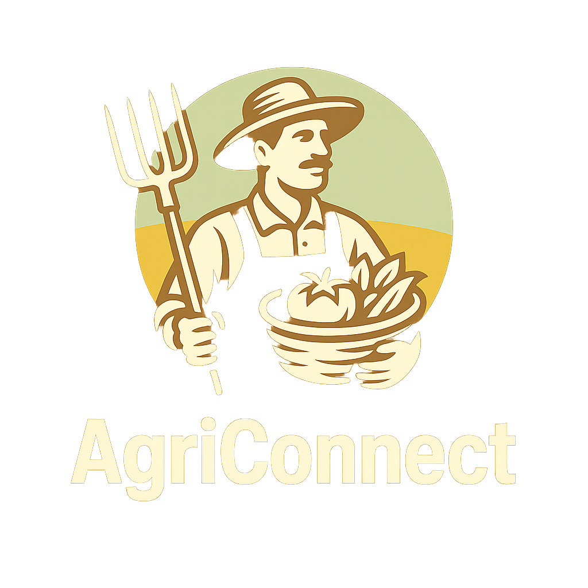

<div align="center">
  
  <h1>🌾 AgriConnect</h1>
  <p><strong>A Full-Stack Agricultural Web Application (MERN Stack)</strong></p>

  <!-- Badges -->
  <p>
    
    
    
    
    
  </p>
</div>

---

**AgriConnect** is a robust agricultural platform designed to digitally connect **👨‍🌾 Farmers**, **🧑‍💼 Suppliers/Sellers**, and **👨‍👩‍👧 Consumers**. The platform enables seamless product management, online sales, equipment renting, secure digital payments, and agricultural service integration.

## 🚀 Key Features

### 👨‍🌾 Farmer Module
* **Manage Farmer Profile:** Maintain up-to-date personal, land, and crop details.
* **Grain Listings:** Add, update, and delete your harvested supply for consumers.
* **Agricultural Marketplace:** Buy vital seeds and pesticides directly from verified suppliers.
* **Heavy Machinery Rentals:** Rent tractors and other heavy farming equipment economically.
* **Financial Assistance:** Apply for agricultural loans and access credit services seamlessly.

### 🧑‍💼 Seller Module
* **Profile Management:** Customize and maintain supplier/seller company configurations.
* **Inventory Control:** Add, manage, and delete seed or machinery products effectively.
* **Stock & Pricing:** Dynamically update item quantities and set profitable pricing templates.

### 👨‍👩‍👧 Consumer Module
* **Account Management:** Securely store personal delivery details via dynamic profile integrations.
* **Explore Marketplace:** Browse globally sourced and naturally grown farm products.
* **Interactive Shopping Cart:** Add, remove, and adjust checkout items with live calculation updates.
* **Digital Checkout:** Secure standard and fast checkout gateways backed by PayPal.

## 💬 Additional Integrations
* **🤖 AI ChatBot:** 24/7 automated assistance responding safely to incoming queries.
* **🔐 Secure Authentication:** JWT-based secure user log-in sessions and heavily encrypted endpoints.
* **🌐 Responsive Interfaces:** Highly engaging frontend constructed using React and Tailwind CSS.
* **⚡ RESTful API:** Standardized JSON formatting communication across Express & Node.js architecture.
* **📦 NoSQL Scaling:** Efficient read/writes leveraging robust MongoDB architecture setups.

## 🏗️ Technology Stack

| Layer | Primary Technology | 
| :--- | :--- | 
| **Frontend Layouts** | React.js, Tailwind CSS, Framer Motion | 
| **Backend Environment** | Node.js | 
| **API Abstractions** | Express.js | 
| **Database** | MongoDB & Mongoose ORM | 
| **Authentication** | JSON Web Tokens (JWT) | 
| **Remote Payments** | PayPal Gateway & Stripe Gateway | 

## 📂 Project Structure
```text
Agriconnect/
├── backend/
│   ├── controllers/
│   ├── models/
│   ├── routes/
│   ├── middleware/
│
├── frontend/
│   ├── components/
│   ├── screens/
│   ├── redux/
│
├── .env
├── package.json
└── README.md
```

## 🔐 Environment Variables Setup

Ensure your local platform is properly initialized. Create a `.env` file exclusively in the **root project directory**:
```env
NODE_ENV=development
PORT=5000
MONGO_URI=your_mongodb_cluster_uri
JWT_SECRET=your_super_secret_jwt_key
PAYPAL_CLIENT_ID=your_paypal_client_id_key
STRIPE_SECRET_KEY=your_stripe_secret_key
```

*Optional if running advanced Google components, create another `.env` file explicitly inside the frontend folder:*
```env
REACT_APP_GOOGLE_KEY=your_google_map_api_key
REACT_APP_STRIPE_PUBLIC_KEY=your_paypal_public_key
```

## 🧰 Installation & Setup Guide

**1️⃣ Clone the Repository**
```bash
git clone https://github.com/pradeep-bhat-ms/Agriconnect.git
cd Agriconnect
```

**2️⃣ System Dependencies**
*(Make sure Node.js is installed)*
```bash
npm install
cd frontend
npm install
```

**3️⃣ Running the Application**
Execute both your backend server and the React layout system utilizing the package concurrently:
```bash
# In the root AgriConnect directory:
npm run dev
```

*(Or to run the Node.js backend exclusively: `npm run server`)*

**4️⃣ Database Seeding (Optional Setup)**
Push the sample JSON seed products and dummy users directly into your MongoDB cloud:
```bash
npm run data:import

# Cleanup
npm run data:destroy
```

## 🏗️ Production Compilation
To compile a lightweight framework explicitly minimizing code overhead for production drops:
```bash
cd frontend
npm run build
```

## 🌐 Live Demo
*Coming Soon... Deployments scheduled!*

## 🌟 Future Enhancements

* **📊 AI-Based Crop Recommendation:** Deep learning mapping recommending crops based on climate & geographic soil models.
* **🌦 Weather API Mapping:** Embedded indicators matching real-time forecasts strictly to farming territories.
* **📱 Dedicated Mobile Port:** Moving React abstractions to native mobile spaces via React Native.
* **📦 Order Tracking Visualization:** Advanced location monitoring during checkout-transit sequences.
* **📄 Automated Invoice Systems:** One-click PDF generations explicitly mapping purchases directly for tax and physical inventory.
* **📩 SMS / Web Notification Logic:** Immediate Push updates signaling restocks seamlessly.

---
<div align="center">
  <i>Digitizing agriculture, one harvest at a time. 🌱</i>
</div>
